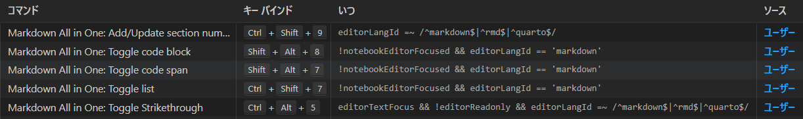

# 1. 学習内容のメモ

- [1. pythonの出力方法](#1-pythonの出力方法)
  - [1.1. バッファリングしないための設定](#11-バッファリングしないための設定)
  - [1.2. Dockerfileのpyproject.tomlの設定変更方法](#12-dockerfileのpyprojecttomlの設定変更方法)
  - [1.3. dockerfileのファイルの有無について](#13-dockerfileのファイルの有無について)
- [アプリケーション内の内容について](#アプリケーション内の内容について)
- [2. markdownのショートカットを勉強したり追加したり](#2-markdownのショートカットを勉強したり追加したり)
  - [2.1. 勉強した内容](#21-勉強した内容)
  - [2.2. ショートカットの追加](#22-ショートカットの追加)
  - [2.3. 設定の追加](#23-設定の追加)

## 1. pythonの出力方法

### 1.1. バッファリングしないための設定

```bash
# pythonの出力表示をDocker用に調整
ENV PYTHONUNBUFFERED=1

# これはpythonの出力をバッファリングしないようにするためのものです。これにより、pythonの出力がすぐに表示されるようになります
```

### 1.2. Dockerfileのpyproject.tomlの設定変更方法

poetryの設定方法として --no-rootを指定する場合がある。

- --no-rootを指定しない場合
  - プロジェクト自身を環境にインストールする（一般的）
- --no-rootを指定する場合
  - プロジェクト自体を開発するというよりも、依存関係を確認するためにインストールしたい場合
  - CI/CD パイプラインや一部のビルドステップで、自分のプロジェクトコードを含めずに依存関係のみをインストールする必要がある場合
  - 環境にプロジェクトがインストールされないことが必要な特定のテストケース

なぜチュートリアルで`--no-root` が指定されているのかは不明

```bash
# poetryでライブラリをインストール (pyproject.tomlが既にある場合)
RUN poetry config virtualenvs.in-project true
RUN if [ -f pyproject.toml ]; then poetry install --no-root; fi
```

### 1.3. dockerfileのファイルの有無について

`COPY pyproject.toml*poetry.lock* ./`のアスタリスク（*）は、ファイル名の後にワイルドカードを指定することで、これらのファイルが存在するかどうかに関わらずコピーしようとする操作を可能にしています。

```bash
# poetryの定義ファイルをコピー (存在する場合)
COPY pyproject.toml* poetry.lock* ./
```

## アプリケーション内の内容について

## 2. markdownのショートカットを勉強したり追加したり

### 2.1. 勉強した内容

- 見出しの追加 / 削除
  - Ctrl + Shift + ]
  - Ctrl + Shift + [
- 目次作成
  - Ctrl + Shift + Pで入力
    - create table of contents
  - ショートカットなし、
  - これを使うとリンク作りやすい
- section Numberをつける
  - 自動採番できる。
  - ショートカットも追加

### 2.2. ショートカットの追加

- Ctrl + Shift + 9
  - Section Numberをつける/更新する
  - Markdown All in One: Add/Update section numbers
- Ctrl + Shift + 7
  - Markdown All in One: Toggle list
- Ctrl + Alt + 5
  - Markdown All in One: Toggle Strikethrough
- Shift + Alt + 7
  - Markdown All in One: Toggle code span
- Shift + Alt + 8
  - Markdown All in One: Toggle code block



### 2.3. 設定の追加

- h1はタイトルとして扱いたい場合
  - Section Numberを h2から適応したい場合は`settinges.json`に `"markdown.extension.toc.levels": "2..6"`を追加する。
